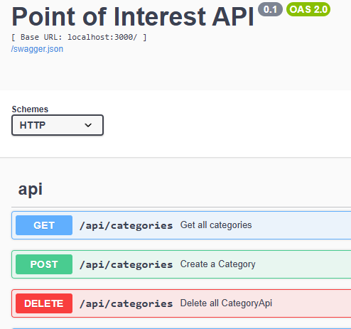

# Point of Interest Project
## Full Stack Dev Assignment 1

### Introduction
** Welcome to your one stop shop for your favourite Point of Interests**

### Description
The UI folder contains initial drafts of project planning. 
The aim of this assignment is to score a high grade and demonstrate good understanding of Javascript and Hapi Framework.

### Installation
1. Download from github
2. install npm node modules
3. Update env file with your own cookie& password and cloudinary account details

### Usage Examples
*admin@admin.com with password admin will allow you access to the admin view. All other accounts will not have permission to the Admin dashboard.
*Example user homer@simpson.com with password 123456 and pre popualted category and point of interest
*Once logged in you can create 1. your Category 2. your POI and optionally upload an image to your category
*All users may contribute to and delete from the comments dashboard

### Swagger Documentation
Visit localhost:3000/documentation to view Swagger documentation

### Licensing Info
Free to share and distribute 

# Credits & Acknowledgements 
SETU 2024 classmates & teachers   
Badges:  
https://shields.io/badges   
Github ReadMe Style:  
https://github.com/adam-p/markdown-here/wiki/markdown-cheatsheet   